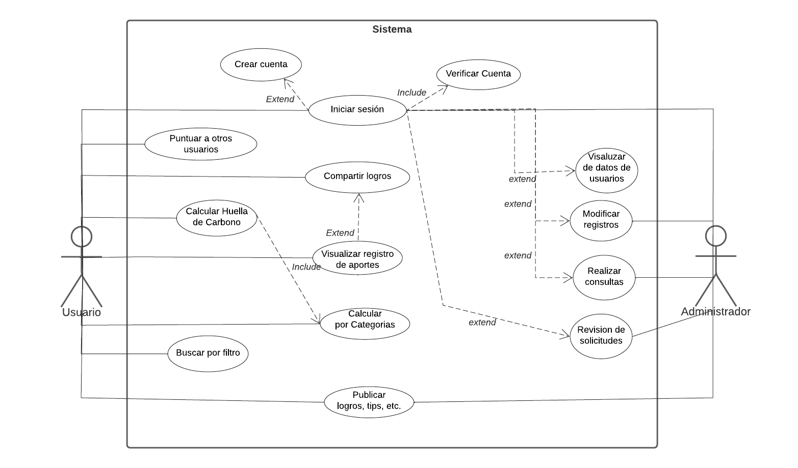

# WorldCare

---

<p align="center">
  
</p>

## Introducción

---

### Propósito

Crear un sitio web que permita a un usuario realizar cálculos y consultas sobre su huella de carbono, así como descubrir noticias positivas y recomendaciones positivas relacionadas con el cuidado del medio ambiente y de esta manera impulsar la mejora medioambiental mediante el reconocimiento de cada aporte brindado por las personas.

### 1.2. Ámbito del sistema

Este proyecto está dirigido al público en general, que estén interesados en el cuidado del medio ambiente, los cuales tendrán la posibilidad de ver su huella de carbono de manera descriptiva, entendiendo el impacto positivo que consiguieron con sus aportes.

## Recursos Humanos

---

La división de cada integrante en un ámbito en específico, para así poder distribuir el trabajo de una manera mucho más fácil y equitativa, utilizando la metodología Scrum, decidimos dar los siguientes cargos a cada integrante:

### Scrum Master

El Scrum Master de nuestro equipo es Kate Itati Olazabal Chavez ya que fue quien tuvo la idea sobre este proyecto, ella será la encargada de guiarnos y resolver las dudas que nos puedan surgir en el desarrollo del proyecto.

### Product Owner

El Product Owner de nuestro equipo es Angel Concha Layme, él será la voz del cliente, en otras palabras, será el enlace entre un cliente y nuestro equipo de desarrollo. Él lleva la visión del producto y lo que se necesita desarrollar, además de gestionar los comentarios de los usuarios.

### Scrum Team

El Scrum Team estará compuesto por Angela Aquise Santos, Edward Luis Huayllasco Carlos, Jorge Alfredo Tito, quienes serán los encargados de convertir World Care en un software entregable. En este caso decidimos dividir el trabajo de cada uno de nosotros en dos partes.

#### Diseñadores

Quien se encargara de generar el diseño arquitectonico y el diseño detallado del sistema será Angela Aquise Santos, basandose en los requisitos.

#### Programadores

Los encargados son Edward Luis Huayllasco y Jorge Alfredo Tito, convertiran los requisitos del sistema en código fuente ejecutable utilizando uno o más lenguajes de programación, así como herramientas de apoyo.

## Descripción General

---

### Perspectiva del producto

WorldCare es una alternativa amigable en comparción a las calculadoras de huella de carbono, que si bien son de fácil acceso y distribución, WorldCare presenta las contribuciones de los usuarios como impactos positivos hacia el planeta, lo que pretende mostrar el valor que tiene cada aporte hecho por los usuarios y estos se mantengan motivados ha realizar más aportes en un futuro.

### Funciones del producto

#### Diagrama de Casos de Uso



#### Caráteristicas del usuario


## Requesitos Específicos

---

### Requisitos Funcionales

- RF-001: Autenticación de Usuario
  Los usuarios registrados deberán identificarse para poder llevar un perfil de usuario.
- RF-002: Registro de Usuario
  El sistema permitirá a los usuarios registrarse. El usuario debe suministrar datos como: Nombre, Apellido, E-mail, Usuario y Password
- RF-003: Consultar tema de interés
  El sistema permitirá a los usuarios realizar busquedas relacionadas al tema de su interés
- RF-004: Consultar huella de carbono
  El sistema permitirá a los usuarios realizar el cálculo de su huella de carbono
- RF-005: Registro de Aportes
  El sistema permitirá a los usuarios llevar un registro de sus aportes
- RF-006: Compartir Aportes
  El sistema permitirá a los usuarios compartir sus logros
- RF-007: Cálculo por categorías
  El sistema permitirá a los usuarios realizar el cálculo de su huella de carbono por categorías
- RF-008: Brindar Información
  El sistema ofrecerá al usuario información general acerca del cuidado ambiental (tips de cuidado ambiental, noticias favorables al medio ambiente, calendario de eventos)
- RF-009: Publicación de Usuarios
  El sistema permitirá a los usuarios hacer una solicitud para publicar sus logros, ideas, tips, avances, etc.
- RF-010: Calificación de publicaciones
  El sistema permitirá a los usuarios calificar los tips de otros usuarios.
- RF-011: Revisión de solicitudes
  El sistema permitirá al administrador revisar las solicitudes del usuario y aprobarlas o desaprobarlas.
- RF-012: Gestión de información
  El sistema permitirá al administrador modificar la base de datos, ver registro general, realizar consultas, añadir información, etc.
- RF-013: Gestión de Usuarios
  El sistema permitirá al administrador visualizar los datos de los usuarios.

### Requisitos No funcionales

- RNF-001:
  El sistema debe tener una interfaz de uso intuitivo y sencillo
- RNF-002:
  El sistema debe contar con manuales de usuario estructurados adecuadamente.
- RNF-003:
  La aplicación web debe poseer un diseño “Responsive” a fin de garantizar la adecuada visualización en múltiples computadores personales, dispositivos tablets y teléfonos inteligentes.
- RNF-004:
  Toda funcionalidad del sistema debe responder en un tiempo razonable.
- RNF-005:
  Los permisos de acceso al sistema podrán ser cambiados solamente por el administrador de acceso a datos.
- RNF-006:
  El despliegue del software

## Guia de uso local

---

### Instalación local en Windows

1. Descargar el software desde el [Repositorio](https://github.com/eluqm/IS-3group6)
2. Instalar el software en una carpeta local
3. Crear entorno virtual con la herramienta [virtualenv](https://virtualenv.pypa.io/en/latest/)
4. Activar el entorno virtual con la herramienta [activate](https://virtualenv.pypa.io/en/latest/userguide/getting-started.html)
5. Instalar las dependencias con la herramienta [pip](https://pip.pypa.io/en/latest/installing.html)

```
 pip install Flask
 pip install PyMySQL
 pip install Flask-SQLAlchemy
 pip install Flask_User
```

6. Crear la base de datos:

```
create database huella_carbono;
```

7. Iniciar el sistema en el entorno virtual:

```
python3 main.py
```

### Instalación local en Linux

1. Descargar el software desde el [Repositorio](https://github.com/eluqm/IS-3group6)
2. Instalar el software en una carpeta local
3. Crear entorno virtual con la herramienta [virtualenv](https://virtualenv.pypa.io/en/latest/)
4. Activar el entorno virtual con la herramienta [activate](https://virtualenv.pypa.io/en/latest/userguide/getting-started.html)
5. Instalar las dependencias con la herramienta [pip](https://pip.pypa.io/en/latest/installing.html)

```
 pip install Flask
 pip install PyMySQL
 pip install Flask-SQLAlchemy
 pip install Flask_User
```

6. Crear la base de datos:

```
create database huella_carbono;
```

7. Iniciar el sistema en el entorno virtual:

```
python3 main.py
```

## Diseño del Sistema

---

En el siguiente link puedes encontrar los mockups realizados en Firgma: https://www.figma.com/file/N3zAk2LUTZ1jyBc3trfgUm/WorldCare?node-id=0%3A1

#### 6.1. Home


#### 6.2. Login


#### 6.3 Registro


#### 6.4 Publicaciones


#### 6.5 Sección Informativa


## Metodologia de desarrollo

---

Para la gestión del proyecto y control del trabajo colaborativo de los integrantes se está trabajando con Trello

Link: https://trello.com/invite/b/3FwjQZeS/51ba1f1450b22478601e12e3090aba5c/worldcare

## Arquitectura

---

La arquitectura que se esta utilizando en este ŕoyecto es con MVC


### Modelo Vista Controlador

Model View Controller - MVC, el Modelo-vista-controlador, es un patrón de arquitectura de software, que separa los datos y la lógica de negocio de una aplicación de su representación y el módulo encargado de gestionar los eventos y las comunicaciones. Para ello MVC propone la construcción de tres componentes distintos que son el modelo, la vista y el controlador, es decir, por un lado define componentes para la representación de la información, y por otro lado para la interacción del usuario. El patrón de diseño MVC es soportado en Flask se divide en tres capas:

### Capa Modelo

- Desarrollado con SQLAlchemy..
- Select, Insert, Delete - Flask-SQLAlchemy).

```python
class User(db.Model):
    __tablename__ = 'users'
    id = db.Column(db.Integer, primary_key=True)
    username = db.Column(db.String(50))
    password = db.Column(db.Text)
    rol = db.Column(db.Integer, db.ForeignKey(
        'roles.id'), nullable=False, default=2)
    #roles = db.relationship('Role', secondary='user_roles')
    roles = relationship(Role, backref=db.backref(
        "children04", cascade="all,delete"))
```

### Capa Vista

- Sistema de plantillas Jinja2 (Capa vista).

```html


    <h2> Publicaciones </h2>
    
        <a href="{{url_for("blog.createPost")}}">Nueva Publicacion</a>
    


    

        
            <article>
                <header>
                    <div>

                        <div class="nameYMegusta">
                            <h1 class="contenido">{{post.title}}</h1>

                            
                             <a class="contenido" href="{{url_for("blog.reaccionarPost",id=post.id)}}">
                                
                            
                            <a class="contenido" href="{{url_for("blog.reaccionarPost",id=post.id)}}">
                                
                            
                            </a>
                            <div class="mensajeCantaidadLikes contenido">
                                {{post.interaccion_number}} Me encanta
                            </div>
                            <div class="contenido">
                                {{getTipoPublicacion(post.clase_post).nombre}}
                            </div>
                        </div>
                        <div class="about">
                            Publicado por {{get_user(post.author).username}}
                            el {{post.created.strftime('%Y-%m-%d')}}
                        </div>

                    </div>

                    <div>
                        
                            <a href="{{url_for("blog.updatePost",id=post.id)}}">
                                Editar
                                </a>
                            <a href="{{url_for("blog.deletePost",id=post.id)}}">Eliminar</a>
                        
                    </div>
                </header>
                <div>
                    <p>{{post.body}}</p>
                </div>
            </article>
        

```

### Capa Controlador

- Blueprint, render_template

```python
blog = Blueprint('blog', __name__, url_prefix='/blog')

@blog.route("/")
def index():
    updatePostLikes()
    posts = Post.query.all()
    posts = list(reversed(posts))
    interacciones = Interaccion.query.all()
    db.session.commit()
    db.session.commit()
    return render_template('blog/index.html', interacciones=interacciones,
                           posts=posts, get_user=get_user, functionInter=InteraccionUserInPosts,
                           getTipoPublicacion=getTipoPublicacion)
```

## Contribuidores

<!-- ALL-CONTRIBUTORS-LIST:START - Do not remove or modify this section -->
<!-- prettier-ignore-start -->
<!-- markdownlint-disable -->

  <table align="center">
    <tr>
      <td align="center"><a href="https://github.com/Angel1612"><br /><sub><b>Angel Concha</b></sub></a><br /><a href="https://github.com/Angel1612" title="Code">
      <td align="center"><a href="https://github.com/Noodle96"><br /><sub><b>Jorge Tito</b></sub></a><br /><a href="https://github.com/Noodle96" title="Code">
      </td>
      <td align="center"><a href="https://github.com/KateOlaz"><br /><sub><b>Kate Olazabal</b></sub></a><br /><a href="https://github.com/KateOlaz" title="Code">
      <td align="center"><a href="https://github.com/Angela18"><br /><sub><b>Angela Aquise</b></sub></a><br /><a href="https://github.com/Angela18" title="Code">
      </td>
      <td align="center"><a href="https://github.com/ehuayllasco"><br /><sub><b>Edwar Huayllasco</b></sub></a><br /><a href="https://github.com/ehuayllasco" title="Code">
      </td>
    </tr>
  </table>